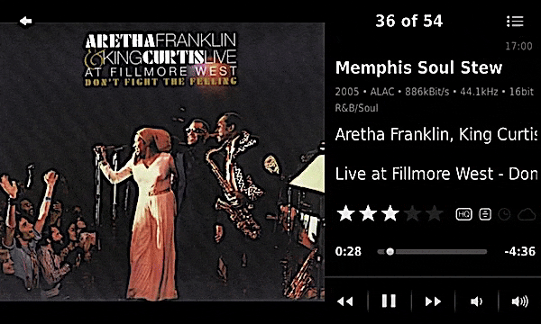
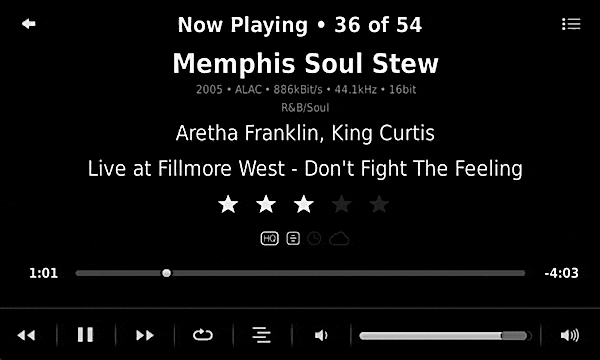
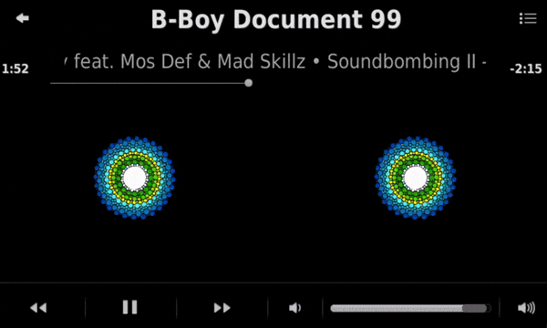
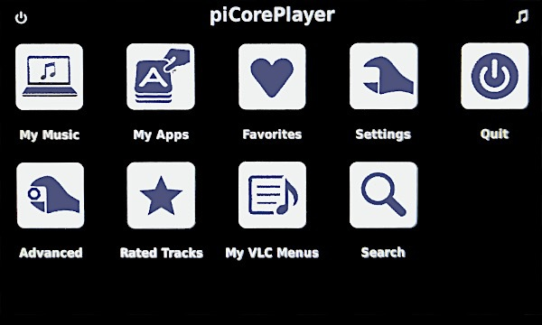

Dark Flat Skin
====

A skin[^1] for (the original) jivelite with a different look, extra information on the *Now Playing* screen (rating, year, status icons, audio meta data, lyrics) and the option to rate a track directly on the *Now Playing* screen.  
For devices running **piCorePlayer** (resolution: 800 x 480), **SqueezePlay** (resolution: 800 x 480) and **SB Touch** (resolution: 480 x 272).  
%3D'applet'%20and%20%40target%3D'jivelite'%20and%20%40name%3D'DarkFlatSkinInstaller'%5D%2F%40version&label=piCorePlayer%20-%20latest%20version) 
%3D'applet'%20and%20%40target%3D'fab4'%20and%20%40name%3D'DarkFlatSkinInstaller'%5D%2F%40version&label=SB%20Touch%20-%20latest%20version) 
%3D'applet'%20and%20%40target%3D'squeezeplay'%20and%20%40name%3D'DarkFlatSkinInstaller'%5D%2F%40version&label=SqueezePlay%20-%20latest%20version)   

> [!IMPORTANT]
> Tested with the following versions: 
> - **original** jivelite (⚠️ <b><ins>not</ins></b> jivelite-*vis*) on **piCorePlayer** **10**.0.0 and **piCorePlayer** **9.2**.0
> - **SB Touch** firmware version **9.0.1** 
> - **SqueezePlay** app version **8.4.1r1498** 

 

[⬅️ **Back to the list of all plugins**](https://github.com/AF-1/)
   

## Features

- display **more information on the Now Playing screen**(s):
	- **rating**, year, genre[^2]

	- **status icons**

		-  = is *lossless*
		-  = has *lyrics*
		-  = has a *custom start/stop time* that the [**CSST** plugin](https://github.com/AF-1/lms-customstartstoptimes#custom-start-stop-times) can use
		-  = is a *remote* track (replaced by streaming service icon if track is part of the LMS library)
	- **audio meta data** (content type, bitrate, sample rate/size)
	- NowPlaying screen with **lyrics** (*SqueezePlay* and *piCorePlayer*) 

- **rate** the current track **directly on the Now Playing screen** ([*Ratings Light*](https://github.com/AF-1/#-ratings-light) plugin required)

- **SB Touch**:

	- use **remote keys** to quickly **rate tracks** ([*Ratings Light*](https://github.com/AF-1/#-ratings-light) plugin required) (see [FAQ](#faq))

	- use a **remote skin version** of DFS called **Dark Flat Skin Large** *(Settings > Screen > Select Skin > Remote Skin)*.

	- new option to make the selection of the *Dark Flat Skin* skin persistent across device reboots *(Settings > Screen > Select Skin)*

- option to replace the Shuffle and Repeat buttons with (half-star) rating buttons

- option to **hide the *Shuffle* button and / or the *Repeat* button** (will increase width of Play, Fwd and Rew buttons)

- **easy way to install and uninstall** the skin using an **installer applet** 

- display the track title in a different color if the track's comments tag contains a user-specified keyword 

- different look (flat, dark) 
 

This skin comes with a limited selection of VU meters (some adapted from pCP) and the default spectrum visualizer. If you're more interested in VU meters and spectrum visualizers, try jivelite-*vis* on piCorePlayer 10+ instead. 

The settings are split between **Settings > Screen > Now Playing** and **Settings > Screen > Dark Flat Skin**.
   

## Screenshots[^3]

  
  
  
  
  
  
  
  
    
**Grid skin (home menu) - piCorePlayer only**  
  

   

## Installation

> [!NOTE]
> To check the currently installed version go to *Settings > Screen > Dark Flat Skin*.
  

**First** you install the skin *installer* applet which you will **then** use to install the *skin*. 

#### #1 - Get the installer

- Make sure that your LMS and your device have internet access. 

- Go to **Settings > Advanced > Applet Installer**. 

- Select and install the **Dark Flat Skin Installer**. Then: 

	- **piCorePlayer**: restart jivelite by using the **Quit** button. 

	- **SqueezePlay**: quit and restart SqueezePlay manually.

	- **SB Touch**: your device will reboot automatically.  

#### #2 - Install the skin

- You should see a new menu item called **Dark Flat Skin Installer** at the top of the home menu. 

- Follow the menu instructions. To complete the installation:

	- **piCorePlayer**: jivelite will **restart** automatically. Does not require a piCorePlayer reboot. 

	- **SqueezePlay**: quit and restart SqueezePlay manually. 

	- **SB Touch**: your device will reboot automatically.  

#### #3 - Enable the Dark Flat Skin

- Go to **Settings > Screen > Select skin** to enable the Dark Flat Skin.

- Browse the [FAQ](#faq) article headlines on this page.
   

## Updating to a newer version

#### #1 - Get the update

- Go to *Settings > Advanced > Applet Installer*. 

- Select and <ins>update</ins> the **Dark Flat Skin Installer**. Then: 

	- **piCorePlayer**: restart jivelite by using the **Quit** button. 

	- **SqueezePlay**: quit and restart SqueezePlay manually.

	- **SB Touch**: your device will reboot automatically.  

#### #2 - Update the skin

- You should see a new menu item called **Dark Flat Skin Updater** at the top of the home menu. 

- Follow the menu instructions. To complete the installation:

	- **piCorePlayer**: jivelite will **restart** automatically. Does not require a piCorePlayer reboot. 

	- **SqueezePlay**: quit and restart SqueezePlay manually. 

	- **SB Touch**: your device will reboot automatically.  

#### #3 - Enable the Dark Flat Skin

- Only if it isn't enabled already: Go to **Settings > Screen > Select skin** to enable the Dark Flat Skin.

   

## Uninstalling the skin

#### #1 - Remove Dark Flat Skin Installer from the list of installed applets

- Go to *Settings > Advanced > Applet Installer*. 

- Select and <ins>remove</ins> the **Dark Flat Skin Installer**. Then: 

	- **piCorePlayer**: restart jivelite by using the **Quit** button. 

	- **SqueezePlay**: quit and restart SqueezePlay manually.

	- **SB Touch**: your device will reboot automatically.  

#### #2 - Remove the skin

- Enable a *different* skin.

- Go to **Settings > Advanced > Uninstall Dark Flat Skin** and follow the menu instructions.

	- **piCorePlayer**: jivelite will **restart** automatically. No reboot necessary. 

	- **SqueezePlay**: quit and restart SqueezePlay manually. 

	- **SB Touch**: your device will reboot automatically.  

    

## FAQ

»<b>I've used the <i>Applet Installer</i> to install the <i>Dark Flat Skin Installer/Updater</i> but there's <i>no menu item</i> with this name.</b>«
 

Confirm that your device has (unlimited) <i>access to the internet</i>. The jivelite Applet Installer (<i>Settings > Advanced > Applet Installer</i>) gets the list of available applets from your (local) LMS server. Your device will then (try to) download the applet <b><i>directly</i></b> from the source (URL).  If you're running <b>piCorePlayer 10+</b>, go to the <b>Tweaks</b> page (web UI), scroll down to <i>jivelite</i> and make sure that you are using the <i>original</i> jivelite and <b><ins>not</ins></b> jivelite-<i>vis</i>. This applet does not work with jivelite-vis.

 

»<b>The Applet Installer doesn't show me the latest applet version.</b>«
 

- Go to <i>Settings -> Advanced -> Applet Installer</i> and confirm that <i>Recommended Applets Only</i> is <b>dis</b>abled. 

- Confirm that your server and device <b>both</b> have <b>internet access</b>. 

- If it's a <b>caching</b> problem, try this: 

    - reload the <i>LMS Settings -> Manage Plugins</i> page so the server has the latest list of available applets 

    - if you enter the <i>Settings -> Advanced -> Applet Installer</i> menu and it doesn't show the latest update, exit the menu and wait a couple of minutes before calling it again.

 

»<b>I can't open the <i>Screen > NowPlaying > NowPlaying Views</i> menu.</b>«
 

This is a jivelite quirk that's not tied to any skin in particular. Just <b>enter the NowPlaying screen</b> using the top right note icon. Then go back and try again. That usually solves it. If not, make sure that you have selected a player and that this player is connected.

 

»<b>How do I switch to next NowPlaying screen from the <i>lyrics</i> NowPlaying screen?</b>«
 

You need to click/touch the <b>track title in the title bar</b>. The lyrics (text) cannot be used for that because you can scroll up or down in the song lyrics using click-hold/touch-hold.

 

»<b>I have changed some skin settings. When I go to the Now Playing screen immediately afterwards, the Now Playing screen does not display the changes, the screen layout is wrong or the buttons don't work as they should.</b>«
 

Sometimes you need to <i>switch to another Now Playing view</i> before the changes take effect.

 

»<b>Clicking/touching the stars on the NowPlaying screen does not change the rating. Why?</b>« »<b>How Do I <b>un</b>rate a track on the NowPlaying screen?</b>« »<b>How do I change the track rating by half a star on the NowPlaying screen?</b>«
 

To rate a track directly on the Now Playing screen, the <b>track must be part of the LMS library</b> (applies to local and remote/online tracks). And you need the <a href="https://github.com/AF-1/#-ratings-light"><b>Ratings Light</b></a> plugin. Make sure the Now Playing screen setting <i>Rate tracks directly on screen</i> is enabled.  
To <b><i>un</i>rate</b> a track click/touch the space to the left or right of the rating stars. Since the space to the <i>left</i> of the rating stars is quite small on Now Playing views <i>with artwork</i>, it's probably better to click/touch the space to the right (about 40px wide).  
Alternatively or additionally, you can replace the <i>Shuffle</i> and <i>Repeat</i> buttons on Now Playing views that display track ratings with <b>rating buttons</b> that will increase or decrease the track rating by half a star. This setting is not enabled by default and can be change here: <i>Settings > Screen > Dark Flat Skin</i>.  
On <b>SB Touch</b> devices you can use your <b>remote keys</b> to <i>rate tracks</i> (<a href="https://github.com/AF-1/#-ratings-light"><b>Ratings Light</b></a> plugin required). The assignment of the SB Touch remote control buttons is explained in a FAQ further below.

 

»<b>I've selected a different VU meter design but it still displays the old one.</b>«
 

Please note: on <b>piCorePlayer</b>, the VU meter you select for the <i>Dark Flat Skin</i> is also used by the <i>Dark Flat <b>Grid</b> Skin</i>. You can't set a different VU meter for the <i>Grid</i> skin.  

For guaranteed success: 

- <b>SqueezePlay</b>: restart SqueezePlay. On <i>Windows</i> (and possibly <i>Linux</i>) selecting a different VU meter requires <i>admin privileges</i>. Please read the corresponding FAQ article below 

- <b>piCorePlayer</b>: use the <i>Quit</i> button to restart jivelite. 

- <b>SB Touch</b>: reboot your device.  

Works <i>sometimes</i>: 

- Go to <b>Settings > Screen > NowPlaying > NowPlaying views</b>. 

- Deselect the analog VU meter view.

- Exit the menu.

- Then reenter the menu and select the analog VU meter view again.

 

»<b><i>SB Touch</i>: Which <i>buttons</i> on the <i>remote</i> control should I use for <i>rating</i>?</b>«
 

Rate the track currently playing on your SB Touch by <b>holding down</b> a button on the IR remote.  Press and <b>hold</b> the key until you see the new track rating on your display confirming the new track rating.  <b>Key map</b>: keys 1 to 5 = 1 to 5 stars 0 = unrate 6 = subtract 1 star from current rating 7 = add 1 star to current rating 8 = subtract 0.5 stars from current rating 9 = add 0.5 stars to current rating

 

»<b><i>SB Touch</i>: <i>after a reboot</i> the device seems to fall back to the <i>WQVGAsmallSkin</i> skin. Selecting the <i>Dark Flat Skin doesn't stick</i>.</b>«
 

This fix applies <b><i>exclusively</i> to SB Touch</b> devices: 

- Go to <i>Settings > Screen > Select Skin</i> 

- set the <b>Touch</b> Skin to <b>Dark Flat Skin</b>

- set the <b>Remote</b> Skin to <b>Dark Flat Skin Large (Remote Skin)</b>

- and then check <b><i>Keep Dark Flat Skin after reboot</i></b>  

 

»<b><i>piCorePlayer</i>: I've enabled the analog VU meter and spectrum visualizer NowPlaying views but when I toggle through the NowPlaying views, these two are missing.</b>«
 

The VU meter and spectrum visualizer are only displayed if the device running jivelite is also a local player (e.g. if you have SqueezeLite running on your piCorePlayer device).

 

»<b><i>SQUEEZEPLAY</i> on <i>WINDOWS</i> and <i>LINUX</i></b>«
 

<b>WINDOWS</b>: 
<b>Installing</b> and <b>uninstalling</b> the skin and <b>changing the VU meter design</b> require <b>admin privileges</b> on Windows, i.e. you need to `run SqueezePlay as admin` to install, uninstall or change the VU meter design.  
The installer has to rename files in and copy files to the <i>NowPlaying</i> and <i>Clock</i> applet folders in the protected <i>jive applet folder</i>. And on Windows, creating symbolic links (to change the VU meter design) seems to require admin privileges too.  
<b>LINUX</b>: 
It probably depends on <i>where</i> you've installed SqueezePlay. The installer requires write permissions (755) to rename files in and copy files to the <i>NowPlaying</i> and <i>Clock</i> applet folders in the <i>jive applet folder</i>. 
If you install the skin using <i>sudo</i>, it will install the userpath skin files in the <i>root</i> user's home folder. And nobody wants to run SqueezePlay as root all the time. 
So either the installer can write to the <i>jive applet folder</i> or you install the applet (files) manually.

 

   

## Report a new issue

To report a new issue, please file a GitHub [**issue report**](https://github.com/AF-1/jivelite-darkflatskin/issues/new/choose).  

If you'd like me to make small changes to the skin, please test the new changes on your device/OS first and then create a pull request with the changes here.
   

## ⭐ Help others discover this project

If you find this project useful, giving it a  (top right of this page) is a great way to show your support and help others discover it. Thank you.
    

[^1]: Based on *JogglerSkin* (piCorePlayer, SqueezePlay) and *WQVGAsmallSkin* (SB Touch).
[^2]: Genre is only displayed on piCorePayer and SqueezePlay. Not enough screen space on SB Touch.
[^3]: The screenshots might not correspond to the current UI in every detail.