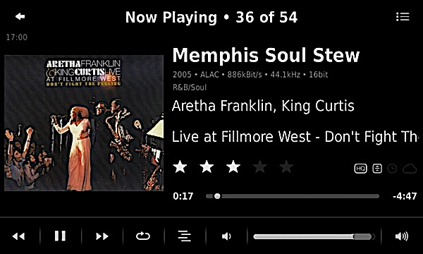
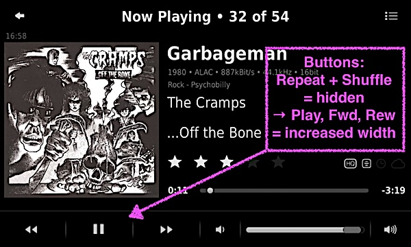
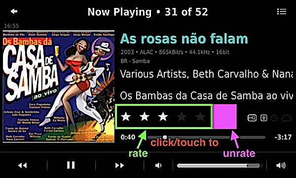
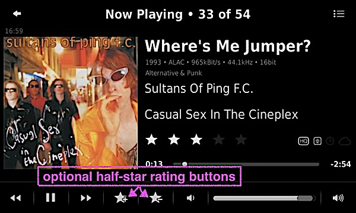

Dark Flat Skin
====

A skin for jivelite with a slightly different look and extra information on the *Now Playing* screen (ratings, status icons, audio meta data, lyrics). Based on *JogglerSkin* (piCorePlayer, SqueezePlay) and *WQVGAsmallSkin* (SB Touch).  
For devices running **piCorePlayer**, **SqueezePlay** and **SB Touch**[^1].  
> **⚠ IMPORTANT** - *only* applies to **SqueezePlay** on **Windows** and **Linux**: 
> please read the FAQ on Windows/Linux BEFORE installing the skin.

 

[⬅️ **Back to the list of all plugins**](https://github.com/AF-1/)
   

## Features

- display **more information on the Now Playing screen**(s):
	- **ratings**

	- **status icons**

		-  = is *lossless*[^2]
		-  = has *lyrics*
		-  = has a *custom start/stop time* that the [**CSST** plugin](https://github.com/AF-1/lms-customstartstoptimes#custom-start-stop-times) can use
		-  = is a *remote* track
	- **audio meta data** (content type, bitrate, sample rate/size)
	- NowPlaying screen with **lyrics** (*SqueezePlay* and *piCorePlayer*) 

- **easy way to install and uninstall** the skin using an **installer applet** 

- colored track title if the track's comment tag contains a user-specified keyword 

- slightly different look (flat, dark) 
 

This skin comes with the usual VU meters and the default spectrum visualizer. If you're more interested in VU meters and spectrum visualizers, there are other skins, e.g. what blaisedias has created (see [LMS forum post](https://forums.slimdevices.com/forum/user-forums/linux-unix/1644111-new-visualisation-features-on-jivelite)). 

Settings are here: **Settings > Screen > Now Playing** and **Settings > Screen > Dark Flat Skin**.
   

## Screenshots

  
  
  
  
  
  

   

## Installation

**First** you install the skin installer applet which you will **then** use to install the skin. 

#### #1 - Get the installer

- Make sure that your LMS and your device have internet access. 

- Go to **Settings > Advanced > Applet Installer**. 

- Select and install the **Dark Flat Skin Installer**. To complete the installation: 

	- **piCorePlayer**: restart jivelite by using the **Quit** button. 

	- **SqueezePlay**: quit and restart SqueezePlay manually.

	- **SB Touch**: your device will reboot automatically.  

#### #2 - Install the skin

> **⚠ IMPORTANT** - *only* applies to **SqueezePlay** on *Windows* and possibly *Linux*: 
> this step requires *admin privileges*. 
> Please read the corresponding FAQ article on *SqueezePlay on Windows/Linux* BEFORE you proceed. 

- You should see a new menu item called **Dark Flat Skin Installer**. 

- Follow the menu instructions. And the end:

	- **piCorePlayer**: jivelite will **restart** automatically. Does not require a pCP reboot. 

	- **SqueezePlay**: quit and restart SqueezePlay manually. 

	- **SB Touch**: your device will reboot automatically.  

#### #3 - Enable the Dark Flat Skin

- Go to **Settings > Screen > Select skin** to enable the Dark Flat Skin.

- Read the FAQ on this page.

   

## Updating to a newer version

- ⚠ **Uninstall the old version first**.

- Then install the latest version.

   

## Uninstalling the skin

> **⚠ IMPORTANT** - *only* applies to **SqueezePlay** on *Windows* and possibly *Linux*: 
> this step requires *admin privileges*. 
> Please read the corresponding FAQ article on *SqueezePlay on Windows/Linux* BEFORE you proceed. 

- Enable a *different* skin first.

- Go to **Settings > Advanced > Uninstall Dark Flat Skin** and follow the menu instructions.

	- **piCorePlayer**: jivelite will **restart** automatically. No reboot necessary. 

	- **SqueezePlay**: quit and restart SqueezePlay manually. 

	- **SB Touch**: your device will reboot automatically.  

    

## Manual install

If your installer failed or does not work for some reason, you can just copy/move the files to the correct locations. 

You need to locate the 2 **applet folders**: 

- the <ins>**user** applet folder</ins> for *user-installed* applets, the path ends with `squeezeplay/userpath/applets/` 

- and the <ins>**jive** applet folder</ins> with the *preinstalled* applets, the path ends with `share/jive/applets`  

Now to some copying and moving: 

- in the <ins>**user** applet folder</ins>: create a folder called `DarkFlatSkin` 

- in the <ins>**jive** applet folder</ins>: copy the `images` folder from the `JogglerSkin` applet folder (*SqueezePlay*, *piCorePlayer*) or the `WQVGAsmallSkin` applet folder (*SB Touch*) to the `DarkFlatSkin` folder in the <ins>**user** applet folder</ins> 

- copy the 2 `lua` files and `strings.txt` from the `DarkFlatSkin` folder **in this repository** to the `DarkFlatSkin` folder in the <ins>**user** applet folder</ins> 

- move the image files from the `DarkFlatSkin/images` folder **in this repository** to the corresponding folders in the `DarkFlatSkin/images` subfolders in the <ins>**user** applet folder</ins> 

- in the <ins>**jive** applet folder</ins>: rename the 2 `lua` files in the `NowPlaying` applet folder (e.g. add `_ORG`_ to the name) and then copy the 2 `lua` files and `strings.txt` from the `NowPlaying` folder **in this repository** there. 

- in the <ins>**jive** applet folder</ins>: rename the `ClockApplet.lua` file in the `Clock` applet folder and copy the corresponding file **from this repository** there. 

    

## FAQ

»<b>I've used the <i>Applet Installer</i> to install/update the <i>Dark Flat Skin Installer</i> but there's <i>no menu item</i> with this name.</b>«
 

The most likely reason is that you had a previous version of <i>Dark Flat Skin</i> on your device. Before you install a new/updated version, please <b>uninstall the previous version first</b>: <i>Settings > Advanced > Uninstall Dark Flat Skin</i>.

 

»<b>I can't open the <i>Screen > NowPlaying > NowPlaying Views</i> menu.</b>«
 

This is a jivelite quirk that's not tied to any skin in particular. Just <b>enter the NowPlaying screen</b> using the top right note icon. Then go back and try again. That usually solves it. If not, make sure that you have selected a player and that this player is connected.

 

»<b>How do I switch to next NowPlaying screen from the <i>lyrics</i> NowPlaying screen?</b>«
 

You need to click/touch the <b>track title in the title bar</b>. The lyrics (text) cannot be used for that because you can scroll up or down in the song lyrics using click-hold/touch-hold.

 

»<b>I've selected a different VU meter design but it still displays the old one.</b>«
 

<b>⚠ IMPORTANT</b> - <ins>only</ins> applies to <b>SqueezePlay</b> on <i>Windows</i> and possibly <i>Linux</i>: 
this step requires <i>admin privileges</i>. Please read the corresponding FAQ article on Windows/Linux BEFORE you proceed. 

For guaranteed success: 

- <b>SqueezePlay</b>: restart SqueezePlay. 

- <b>piCorePlayer</b>: use the <i>Quit</i> button to restart jivelite. 

- <b>SB Touch</b>: reboot your device.  

Works <i>sometimes</i>: 

- Go to <b>Settings > Screen > NowPlaying > NowPlaying views</b>. 

- Deselect the analog VU meter view.

- Exit the menu.

- Then reenter the menu and select the analog VU meter view again.

 

»<b><i>SQUEEZEPLAY</i> on <i>WINDOWS</i> and <i>LINUX</i></b>«
 

<b>WINDOWS</b>: 
<b>Installing</b> and <b>uninstalling</b> the skin and <b>changing the VU meter design</b> require <b>admin privileges</b> on Windows, i.e. you need to `run SqueezePlay as admin` to install, uninstall or change the VU meter design.  
The installer has to rename files in and copy files to the <i>NowPlaying</i> and <i>Clock</i> applet folders in the protected <i>jive applet folder</i>. And on Windows, creating symbolic links (to change the VU meter design) seems to require admin privileges too.  
<b>LINUX</b>: 
It probably depends on <i>where</i> you've installed SqueezePlay. The installer requires write permissions (755) to rename files in and copy files to the <i>NowPlaying</i> and <i>Clock</i> applet folders in the <i>jive applet folder</i>. 
If you install the skin using <i>sudo</i>, it will install the userpath skin files in the <i>root</i> user's home folder. And nobody wants to run SqueezePlay as root all the time. 
So either the installer can write to the <i>jive applet folder</i> or you simply install the applet (files) manually.

 

»<b>I've manually deleted some files/folders on my device. Now it's stuck in a jivelite restart loop (pCP, SB Touch) or falls back to a tiny screen skin.</b>«
 

If you have manually deleted the skin files/folders instead of using the uninstaller, jivelite will still try to load the (missing) Dark Flat Skin. You need to change the selected skin value in the <i>SelectSkin.lua</i> settings file to a skin that's still installed, e.g. JogglerSkin or WQVGAsmallSkin (for SB Touch) and reboot your device.

 

»<b><u>piCorePlayer</u>: I've enabled the analog VU meter and spectrum visualizer NowPlaying views but when I toggle through the NowPlaying views, these two are missing.</b>«
 

The VU meter and spectrum visualizer are only displayed if the device running jivelite is also local player (e.g. if you have SqueezeLite running on your pCP device).

 

»<b>The Applet Installer doesn't show me the latest applet version.</b>«
 

Provided that the latest version has been picked up by the repository and that your server and your device have internet access, it's probably a caching problem. Usually one or a combination of the following helps: restart LMS, reload the Settings > Plugins page, reboot your device.

 

»<b><u>SB Touch</u>: <i>after a reboot</i> the device seems to fall back to the <i>WQVGAsmallSkin</i> skin. Selecting the <i>Dark Flat Skin doesn't stick</i>.</b>«
 

The SB Touch knows 3 different skins settings: <b>Touch</b> Skin, <b>Remote</b> Skin, and just <b>”Skin”</b>. The GUI menus will let you change the <b>Touch</b> and the <b>Remote</b> skin type but not the type <b>“Skin“</b> which resets to <i>WQVGAsmallSkin</i> after every reboot. 
However, it's easy to fix: 

- go to **Settings > Screen > Select skin > Touch Skin** 

- select <i>WQVGAsmallSkin</i> 

- and then select <i>Dark Flat Skin</i> again.  

It's a trade-off: <i>Dark Flat Skin</i> is a stand-alone/separate applet that's easy to install/uninstall. But that causes quirks like this one. It only happens after a <i>reboot</i>. So decide for yourself if you think it's worth it.

 

   

## Reporting a new issue / enhancement requests

If you want to report a new issue, please fill out this [**issue report template**](https://github.com/AF-1/jivelite-darkflatskin/issues/new?template=bug_report.md&title=%5BISSUE%5D+).  

If you'd like me to make small changes to the skin, please test the new changes on your device/OS first and then create a pull request with the changes here.
   

[^1]: I don't own SB Touch devices. So I can't work on the SB Touch version. For known issues on SB Touch devices, please see the FAQ.
[^2]: Some status icons like the **HQ**/lossless icon require a version of LMS that includes the d0e5722 commit. I will remove this notice as soon as the stable bug fix branch (8.3.x) supports this too.